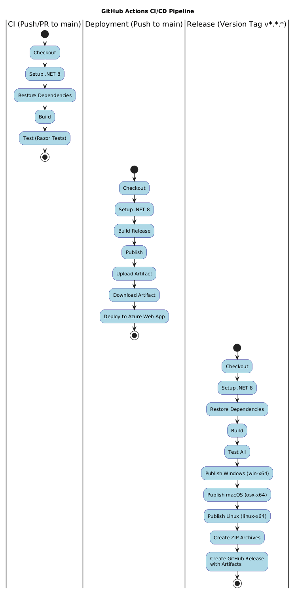
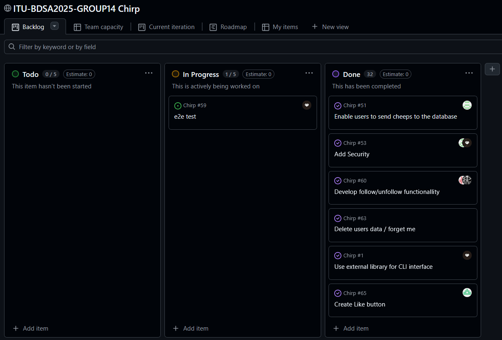

- [Design and Architecture of _Chirp!_](#design-and-architecture-of-chirp)
  - [Domain model](#domain-model)
    - [Validation and Constraints](#validation-and-constraints)
  - [Architecture — In the small](#architecture--in-the-small)
      - [1. Domain Layer (Core)](#1-domain-layer-core)
      - [2. Repository Layer](#2-repository-layer)
      - [3. Service Layer](#3-service-layer)
      - [4. Application and Test Layer](#4-application-and-test-layer)
  - [Architecture of deployed application](#architecture-of-deployed-application)
  - [User activities](#user-activities)
  - [Sequence of functionality/calls through _Chirp!_](#sequence-of-functionalitycalls-through-chirp)
- [Process](#process)
  - [Build, test, release, and deployment](#build-test-release-and-deployment)
    - [Continuous Integration (Build \& Test)](#continuous-integration-build--test)
    - [Continuous Deployment (Azure)](#continuous-deployment-azure)
    - [Release Management (GitHub Releases + Versioning)](#release-management-github-releases--versioning)
  - [Teamwork](#teamwork)
  - [How to make _Chirp!_ work locally](#how-to-make-chirp-work-locally)
  - [How to run test suite locally](#how-to-run-test-suite-locally)
  - [Test suites](#test-suites)
    - [Chirp.PlaywrightTests](#chirpplaywrighttests)
    - [Chirp.Razor.Tests](#chirprazortests)
- [Ethics](#ethics)
  - [License](#license)
  - [LLMs, ChatGPT, CoPilot, and others](#llms-chatgpt-copilot-and-others)

# Design and Architecture of _Chirp!_

## Domain model
The Domain model illustrates the main concepts of the Chirp! project, namely `Author` and `Cheep`. We've implemented Likes as a core concept as well. The IdentityUser is connected to the Author by matching of username at runtime. When a logged-in user posts, the author name is used to find, or creates the author based on their username. The identity framework handles authentication, and the Author entity models the concept in the code, and are not formally related besides through username matching.

The Author entity contains information about a User, their relationship with Cheeps, as well as followers/followings, and posts they've liked.
The Cheep entity contains information of who wrote the cheep, as well as who has liked the cheep.
The Like entity contains information about who has liked which tweet, and when. It's the relationship between an author liking a cheep, and the cheep itself.


Where the Author and Cheep contain lists of the other entities as they are one-to-many/many-to-many relations, the Like entity is a one-to-one relation between a Cheep and an Author.

### Validation and Constraints
- For the Cheep entity, validation is made to ensure a cheep doesn't exceed 160 characters.
-  When a new cheep is created a validation check to see if a user is logged in is made, as well as to check if the ApplicationUser has an Author created/associated. If not, a new Author is made and linked based on the username of the user.
-  Validation whether a user is logged in or not, when trying to like a message is also in place.

## Architecture — In the small
This diagram shows the architecture of our Chirp! project as organized after onion architecture, creating separation of concerns between each part of the project. The four layers depicted are as follows:


#### 1. Domain Layer (Core)
This layer contains the core business concepts of the project such as `Author`, `Cheep`, `Like` as well as the DTOs and repository interfaces which the next layer can interact with.
There's no EF Core, web application or database code on this layer.

#### 2. Repository Layer
This layer implements data access contracts from the domain, and this is the layer in which data access as well as data persistance is handled. Repositories for accessing data is required in this layer. The database also fits in this layer, as this is where the direct access to the database is made using the repositories.

#### 3. Service Layer
The service layer acts as a mediator between the application and repository layers. In this layer the CheepService lives, which has access to `AuthorRepository`, `CheepRepository` and `LikeRepository`, which the webserver uses (through the service layer) to get access to the database. This layer prepares data accessed through the Repository layer, and serves it to the application layer.

#### 4. Application and Test Layer
The last layer contains the webserver, as this is the presentation and entry point. This layer depends on services and repositories via dependency injection. This is also the layer where we find the test suites for the webserver Razor tests, as well as the End-2-End UI tests using Playwright

## Architecture of deployed application
The Chirp! Application is hosted on an Azure webhost. When code is pushed to the main branch on GitHub, the GitHub Actions starts a workflow to deploy the code to the Azure hosted webservice. The webservice is hosted using the free F1 plan. This is meant for learning and lightweight APIs, but are unsuited for use in production due to the limited amount of memory available for use. We've run into a problem of running out of CPU available early on in the project, as we kept repopulating the entire database on Azure using the `DbInitializer` class, which led to this only being run when the service is started locally.
 
A client can access the website using the link `https://bdsagroup14chirprazor.azurewebsites.net/` and will be able to see cheeps posted from other clients in real time. This is only possible because the project is so small, and only a small amount of requests/responses are sent and recieved from the Azure hosted webserver, every day. An SQLite database has also been configured for the webservice, and is accessible for read/write through the use of the Chirp! project, leading to persistent data.


## User activities
When an unauthorized user accesses the Chirp application they are met by the public timeline. A user can then choose one of two paths: registering as a new user or logging in with existing user credentials. Users can either create an account with an email or using their GitHub. Similarly users can log in with those credentials or with their GitHub account that they have linked.

Once this step is completed users will be considered authorized and will gain access to many other features on the Chirp app. Users can like cheeps and choose to follow other 'Cheepers' whose cheeps will show up on their own private timeline if followed. Users can also access the timeline of other users, however, only the cheeps written by other users will show up, not the cheeps of the users which that user follows. Users can log out anytime from their account. There is also a tab where it is possible to manage your account details. From here you can download your user data, delete your account, autenticate with Github (if you have not already), and edit account details.

The UML Diagram shows the order in which users can complete these various activities whether they start as an unauthenticated user or not.


## Sequence of functionality/calls through _Chirp!_
Below is a UML sequence diagram visualizing a logged in user, creating a new cheep in the Chirp project. It starts with an HTTP post request, which triggers the OnPostAsync method, going through the `AuthorRepository` checking an author exists in the database, before creating the cheep, using the `CreateCheep` method in the `CheepService` going through the `CheepRepository` to create the new cheep in the database.

When the Cheep have been created the user will be redirected to the start page through an HTTP GET request, once again going through the `CheepService` and `CheepRepository` to get all cheeps posted and their authors from the database, and finally displaying all cheeps, as well as the newly created cheep, to the user, sending a 200 OK request to the browser from the webserver.


# Process

## Build, test, release, and deployment


The above diagram illustrates the three GitHub Actions workflows that are used in the Chirp! project: Continuous Integration, Continuous Deployment, and Release Management.

### Continuous Integration (Build & Test)
The .NET workflow runs automatically on every push to the main branch, as well as every pull request targeting main. This means that all code changes are validated before being merged.

The workflow executes these following steps:
1. Checkout: clones the repository
2. Setup .NET 8: installs the .NET 8 SDK
3. Restore Dependencies: downloads all NuGet packages
4. Build: compiles the solution
5. Test: runs the Chirp.Razor.Tests test suite (unit and integration tests)

Only the Razor tests are executed in CI, since the Playwright End-2-End tests require the server to be running and browser infrastructure, which is not configured in this workflow.

### Continuous Deployment (Azure)
The deployment workflow is triggered automatically on every push to the main branch, and can also be triggered manually via workflow_dispatch. It consists of two jobs: build and deploy.

The Build job:
1. Checkout: clones the repository
2. Setup .NET 8: installs the .NET 8 SDK
3. Build Release: compiles Chirp.web in Release configuration
4. Publish: creates deployment-ready output
5. Upload Artifact: stores the published output for the deploy job

The Deploy job (runs after build completes):
1. Download Artifact: retrieves the published output
2. Deploy to Azure Web App: Deploys to bdsagroup14chirprazor using a publish profile which is stored in GitHub Secrets

The application is deployed to Azure App Service in the Production slot.


### Release Management (GitHub Releases + Versioning)
The release workflow is triggered when a version tag which matches v*.*.* (e.g., v1.5.1) is pushed to the repository, and it follows semantic versioning.

The workflow:
1. Checkout: clones the repository
2. Setup .NET 8: installs the .NET 8 SDK
3. Restore Dependencies: downloads all NuGet packages
4. Build: compiles the solution
5. Test: runs all of the tests to make sure the release is stable
6. Publish: creates executables for Windows (win-x64), macOS (osx-x64), and Linux (linux-x64)
7. Create ZIP Archives: packages each platform's output
8. Create GitHub Release: publishes the release with all three ZIP files as downloadable artifacts.


## Teamwork

We've gotten around about every required task as specified in the day-to-day project description in GitHub. A final End-2-End test using Playwright to get around the entire project in a single test has not been made, and is therefore in progress still, though smaller UI tests using Playwright has been created, and are all fully functional.

Every week we've read through all the requirements posed in the project work part of the lecture notes GitHub, and transformed each requirement into a GitHub issue.

We as a group went through each requirement individually and created success criteria for the requirement, as well as a user story and a small description to make sure each requirement would be implemented satisfactorily.

At the beginning we had neither a description or a user story, as we misinterpreted the way to create issues, but we've afterwards edited all issues to contain both things, and it made development a lot easier. Each issue was then assigned to a single person, who would then work on the issue from start to completion. As the issue is assigned, we've moved it into "In development" in our project board.

We made use of pair programming, making sure a lot of the slightly meatier issues, had two developers looking at it at once, and making sure knowledge was spread out throughout the group. We've tried to adhere to trunk-based development, branching out, and merging into the ‘main’ stream at the start and end of a day, but larger issues have been allowed to live for longer.
 
We have had issues creating continuous releases, since we were unaware that Git tags had to be explicitly pushed to GitHub (git push --tags) to trigger the release workflow. This resulted in fewer version tags and fewer automated releases than intended.

At the end of development of a feature, a pull request is opened, and someone who's not been a part of development is assigned to review the PR such that knowledge of the feature is shared across the group, without everyone having to actively be part of developing every feature. Once the pull request has been reviewed and accepted, given no merge conflicts, and the branch building with GitHub workflows, and all tests pass, the development branch will be merged into the ‘main’ branch, and the development branch is to be deleted.

We have done our best to follow this flow, though there's been times where a branch has been forgotten, and thus lived longer, or we've felt it necessary to keep it alive, to easily access what changes had been made. Once everything is reviewed, accepted, and merged into ‘main’, the issue will be moved to done, and then closed.
 

## How to make _Chirp!_ work locally
To clone the project you need to have Git installed on your local machine
- [Install Git](https://git-scm.com/install/)

When Git is installed, run the following command in your terminal, or the Git CLI
```
git clone https://github.com/ITU-BDSA2025-GROUP14/Chirp.git
```

To run the Chirp project you need to have .NET 8 installed
- [Install .NET 8](https://dotnet.microsoft.com/en-us/download/dotnet/8.0)

After you have cloned the repository down to your local machine, navigate to the Chirp.Web folder of the project using following command
```
cd ./chirp/src/Chirp.web
```

Now run the following commands, to setup authentication secrets locally
```
dotnet user-secrets init
dotnet user-secrets set "Authentication:GitHub:ClientId" "Ov23licogNiZV33XuQcv"
dotnet user-secrets set "Authentication:GitHub:ClientSecret" "ff78c1b915997b82cc74bddf8e72248884954cb3"
```
Now you should be able to run the project using

```
dotnet run
```
The project will be running locally on http://localhost:5273. Navigating to this address should take you to the front page of the Chirp! application where you're able to see all posted cheeps, and you can login, to begin posting your own cheeps locally!

## How to run test suite locally
To run the test suite locally please have .NET 8 and Playwright installed. You need to use the terminal to run the commands needed for running the tests.
- Install Playwright
- Install .NET

To install .NET see the last section of the report.

To install Playwright, navigate to the `Chirp.PlaywrightTests` folder and install the required browsers using the following commands using powershell.
```
cd test\Chirp.PlayWrightTests
pwsh bin/Debug/net8.0/playwright.ps1 install
```


Then you can navigate back to the root folder `Chirp` and run the following commands in your terminal.

Navigate to root folder
```
cd ..\..\
```

Build the project and tests
```
dotnet build
```

Run the Chirp.Razor.Tests tests
```
dotnet test .\test\Chirp.Razor.Tests
```

To run the PlayWright tests, the server has to be running, so start the server using the commands as in the previous section from the `Chirp.Web` folder, and then from another terminal window run the command.
```
dotnet test .\test\Chirp.PlaywrightTests\
```

## Test suites
To prevent bugs and ensure requirements from issues are fulfilled, we have several test suites in our repository. namely we have Unit tests, Integration tests, and End-to-End tests and UI tests.

The structure of the tests are as follows
```
Project root
|-- test
    |-- Chirp.PlaywrightTests
    |-- Chirp.Razor.Tests
```

The Chirp.PlaywrightTests folder contains UI and end-to-end tests, the Chirp.Razor.Tests folder contains the remaining tests.

### Chirp.PlaywrightTests
The Playwright testsuite is created to ensure the UI is tested, and that End-2-End tests are done automatically to ensure the entire system functions, after changes to the system.

This folder contains the following tests
- PlayWrightTestBase
- PostCheepFlowTests
- RegisterTest

The `PlayWrightTestBase` contains the base setup for the UI tests, setting up a browser, giving it context, and setting up Playwright, whereas `PostCheepFlowTests` and `RegisterTest` each tests different UI functionality, with either logging in, and posting a cheep, or registering a new user. Many more UI tests could be made, but because of the time restrictions we've chosen these to make up the most important functionality to be tested in our project.

### Chirp.Razor.Tests
The Chirp.Razor.Tests suite contains tests for the backend functionality of the Razor pages which is used in the project.

The folder contains the following tests
- CustomWebApplicationFactory.cs
- CsrfProtectionTests.cs
- SecurityReggressionTests.cs
- SqlInjectionTests.cs
- TextDBContextFactory.cs
- CheepPostingTests.cs
- CheepRepositoryTests.cs
- LikeRepositoryTests.cs
- PaginationUnitTests.cs
- PublicPageTests.cs
- TimelineIntegrationTests.cs

The CustomWebApplicationFactory and TestDBContextFactory provide the foundational setup for our different Razor Tests, configuring the test server and database context to simulate realistic application behavior, without using our main system. 
CsrfProtectionTest and SqlIntjectionTests focus on securing the applications strength to defend against common web vulnerabilities, while SecurityRegressionTests ensure that previously fixed issues remain solved.

Functionality-specific tests like CheepPostingTests, CheepRepositoryTests, PublicPageTests, PaginationUnitTest and LikeRepositoryTests help verifying core features in our program. 

# Ethics
## License
We've chosen to use an MIT License as it gives us the most freedom for our project. It grants us the rights to modify and distribute our project as we see fit, and allows other to use our code in their own projects, as long as Attribution i.e the original copyright notice and license text is included in the software.

## LLMs, ChatGPT, CoPilot, and others
[ChatGPT ](https://chatgpt.com/) has been used during development. We've very early on set limitations on using LLM's and ChatGPT, as we've wanted to develop this project using our own intuition, and learn the proper tools for developing, as well as getting a feel for using C# as whole. We've been urged to make use of LLM's during development throughout the project though, and has since about halfway through the project, made use of mainly ChatGPT to create and help create tests for the different parts of the system. ChatGPT has also been used as a resource to bounce ideas off of and has been coauthored in every commit, where it's been used.

The use of LLMs significantly sped up development, as it has been quick to make a useful test suite, especially when given context, and guiding text as to how to create the tests. It's also helped when stuck on essential implementation or understanding issues in regards to using the Entity framework as well as when implementing 3rd party logins.
